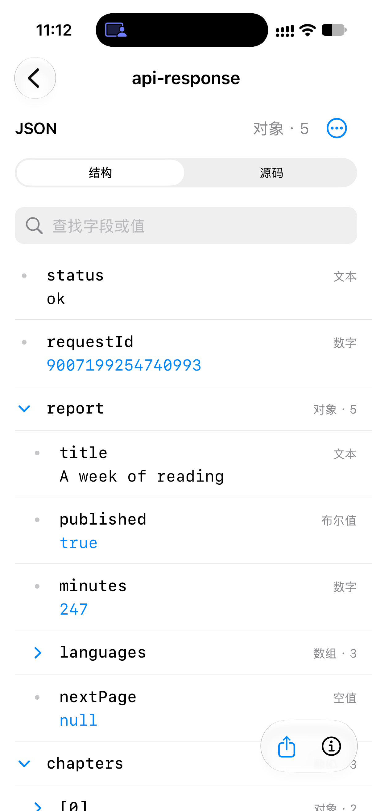
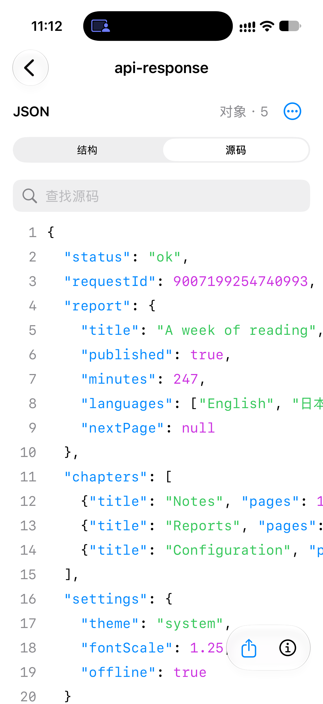
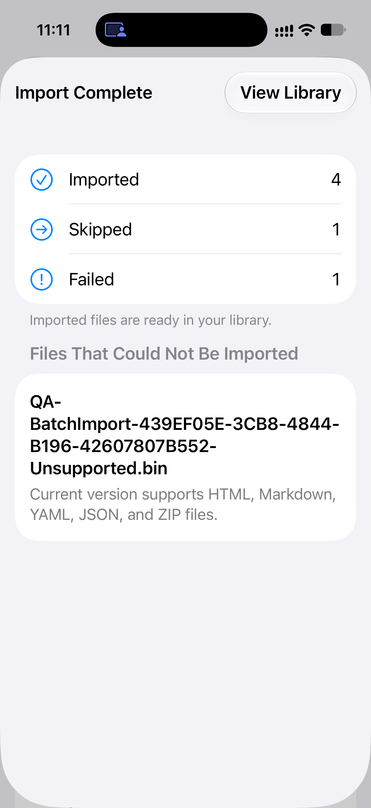
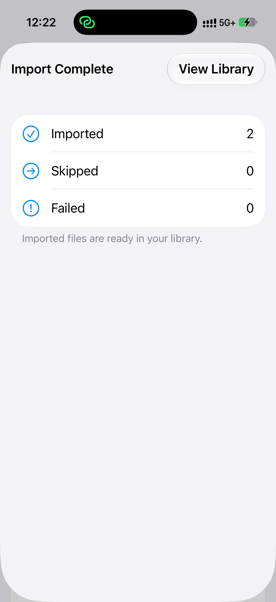
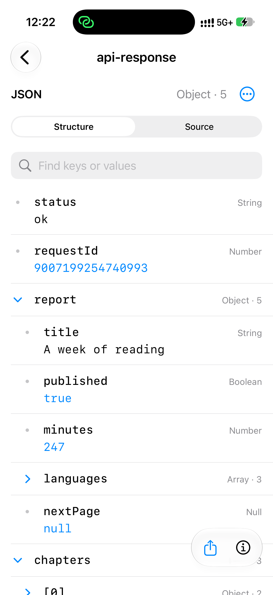

# JSON 与批量导入：iPhone 17 真机验证

2026-10-03。状态：**本轮完成：12 项原有自动测试最终均取得通过记录，另一次系统文件选择器实际多选导入通过；已恢复正常资料库**。

## 构建与设备

- 源码：`fdf1fdb6fb44e924da633a5e5227b3741fd70b20`，分支 `codex/json-batch-preview`。
- 实际设备：iPhone 17，iOS 27.0（24A437）。XCTest 结果中的平台为 `iOS`，不是模拟器。
- Debug 开发签名构建，`com.kaede.htmlmarkdownpreviewer`，工程版本仍为 1.6（11）。构建及 `codesign --verify --deep --strict` 通过。
- 用户最初指定的 iPhone X 实测运行 iOS 16.7.16，不满足应用 iOS 17 最低要求；用户随后同意改用 iPhone 17。
- 应用原位安装，没有卸载。测试使用 `HTML_PREVIEWER_UI_TESTS=1` 的独立资料库和偏好设置。

## 已通过

三次真机运行合计覆盖 **12 个不同测试，最终均有 Passed 记录**。首轮和续跑保留了失败结果，不能表述为一次全部通过。

| 运行 | 通过 / 失败 | 说明 |
| --- | --- | --- |
| 首轮 `iphone-ui.xcresult` | 8 / 4 | 后四项因系统 UI 自动化授权错误中断 |
| 用户解锁并授权后续跑 `iphone-ui-resume.xcresult` | 3 / 1 | HTML PDF、YAML、ZIP 通过；Smoke 未找到 Safe Preview 菜单项 |
| Smoke 单项重跑 `iphone-smoke-recheck.xcresult` | 1 / 0 | 同一个 Smoke 测试通过，耗时 75.78 秒 |

| 检查 | 结果 |
| --- | --- |
| 批量导入遇到失败后继续、更新重复文件、保留两份、跳过、结果汇总 | 通过 |
| 全部文件失败时仍显示完整结果 | 通过 |
| 单文件直接打开，不出现批量汇总 | 通过 |
| JSON 搜索找到折叠字段、切换源码、重新打开和重启后保留模式 | 通过 |
| 系统粘贴识别 JSON，精确复制大整数、路径、集合和完整源码 | 通过 |
| JSON 错误行定位、保留原文、原文件分享、禁用 PDF 导出 | 通过 |
| JSON 中日文界面、源码及辅助功能大字号 | 通过 |
| Markdown 代码精确复制、离线公式/图表、搜索、目录和阅读位置恢复 | 通过 |
| HTML、Markdown、ZIP 内置样例、设置、安全预览与原文模式 | 单项重跑通过 |
| HTML PDF 导出及重复导出显示系统分享面板 | 续跑通过 |
| YAML 结构/源码搜索、多文档切换及重新打开和重启恢复 | 续跑通过 |
| ZIP 页面选择/搜索、相对链接、返回及重启后恢复所选页面 | 续跑通过 |

已人工查看真机截图，确认 JSON 结构、源码行号和批量结果显示正常。

| JSON 结构 | JSON 源码 | 批量结果 |
| --- | --- | --- |
|  |  |  |

## 中断与重试记录

首轮以下四项均报告相同系统错误：`Failed to get matching snapshots: Not authorized for performing UI testing actions.` 后续观察时手机处于锁屏，测试进程已经结束。用户解锁并授权后，已重跑这些测试并取得最终通过记录；首轮系统错误不能据此判定为产品故障。

- `SmokeUITests/testBuiltInSamplesAndSettingsSmoke`
- `SmokeUITests/testHTMLPDFExportShowsShareSheet`
- `YAMLPreviewUITests/testStructureSourceSearchMultipleDocumentsAndReopen`
- `ZIPNavigationUITests/testPackagePagesSearchLinksBackAndLastPageSurviveRelaunch`

续跑的 Smoke 在 `SmokeUITests.swift:128` 报告 `Missing tappable element`。日志显示 22.96 秒点击模式菜单，23.34 秒发生横屏切换，随后等待 Safe Preview 菜单项期间又切回竖屏。旋转与菜单项消失有时间关联，菜单被旋转关闭属于推断，不能据此确认为产品原因。该测试单项重跑取得 Passed 记录。

## 系统文件选择器实际导入

将两份内置样例通过系统“存储到文件”保存至手机本地的新建 `HTMLPreviewerQA` 目录，然后从空的独立测试资料库点击“Open File”，在系统选择器的“Recents”页实际多选两份文件并点击 Open。结果为 **Imported 2 / Skipped 0 / Failed 0**，返回资料库后分别打开 JSON 与 Markdown。

- `api-response.json`：449 字节，结构视图中的 `requestId` 精确显示为 `9007199254740993`。
- `reading-notes.md`：1,199 字节，Markdown 正常渲染。
- 两份导入记录的 `importSource` 均为 `fileImporter`；只复制本次合成测试文件，导入前后的 SHA-256 均相同。见[原始字节校验](assets/2026-10-03-json-batch/system-import-evidence.json)。

Device Hub 镜像能显示画面，但坐标点击持续报 `noWindowsAvailable`，因此实际多选步骤改用 XCTest 驱动同一台真机的系统选择器。一次性测试 `PhysicalFilesPickerQA/testActualFilesPickerImportsJSONAndMarkdown` 通过（27.48 秒）；该测试片段已从工程移除，只在忽略的本地证据目录留档，没有修改应用功能代码。系统选择器截图包含其他个人文件名，仅保留在忽略的本地结果包，未加入文档资产。

| 系统选择器导入结果 | 实际导入的 JSON |
| --- | --- |
|  |  |

Mail、AirDrop、iCloud 和第三方应用的外部导入路径不在本轮已验证范围内；Release / TestFlight 包也需在最终版本上另做验收。

## 资料库与设备交还

已清空本次 Debug 独立测试资料库，仅剩空的 `Imports` 目录。随后不带测试环境变量及启动参数重新启动应用，真机截图确认恢复正常日文界面与原有资料库。

测试前与最终交还后，正常资料库均为 **102 个目录/文件条目**；逐项比较路径、大小、时间戳等清单元数据完全一致，没有新增、删除或变化。没有复制用户文件内容进行哈希校验，因此这一检查不宣称逐字节验证。

手机“文件”中的 `On My iPhone/HTMLPreviewerQA` 保留本次创建的两份测试样例（共 1,648 字节），可用于人工复核；未清空“最近删除”。本轮只使用用户同意的既有 iPhone 17，没有启动、新建、克隆、抹除或删除模拟器。

## 本地证据

下列路径相对于仓库根目录，属于忽略的构建产物：

- `DerivedData/JSONBatchDeviceQA/build.log` 与 `build.xcresult`。
- `DerivedData/JSONBatchDeviceQA/build-metadata.json`。
- `DerivedData/JSONBatchDeviceQA/iphone-ui.xcresult` 与 `iphone-ui-summary.json`。
- `DerivedData/JSONBatchDeviceQA/iphone-ui-resume.xcresult`、`iphone-ui-resume-summary.json` 与 `iphone-ui-resume.log`。
- `DerivedData/JSONBatchDeviceQA/iphone-smoke-recheck.xcresult` 与 `iphone-smoke-recheck.log`。
- `DerivedData/JSONBatchDeviceQA/resume-screenshots/manifest.json`。
- `DerivedData/JSONBatchDeviceQA/screenshots/manifest.json`。
- `DerivedData/JSONBatchDeviceQA/iphone-files-picker.xcresult`、`iphone-files-picker-summary.json` 与 `iphone-files-picker.log`。
- `DerivedData/JSONBatchDeviceQA/physical-picker-test.swift` 与 `picker-screenshots/manifest.json`。
- `DerivedData/JSONBatchDeviceQA/picker-byte-verification.json`。
- `DerivedData/JSONBatchDeviceQA/normal-app-handoff.json`、`normal-app-handoff.png` 与 `normal-library-final.json`。
- `DerivedData/JSONBatchDeviceQA/library-preservation-summary.json`。

本轮没有修改应用功能代码、推送 Git、上传 TestFlight 或提交 App Store；没有启动、新建或删除模拟器。
