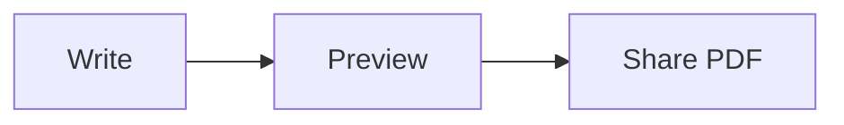

# Markdown code, mathematics and diagrams

This change adds an offline enhanced reader for Markdown containing fenced code,
LaTeX math or Mermaid diagrams. Ordinary Markdown retains its native reader.
The library, importer, raw-text mode and reading controls continue to use the
same saved documents. This work does not add navigation between ZIP pages.

## Writing content

Specify a language on a fenced code block, such as `swift`, `python`, `javascript`,
`typescript`, `json`, `html`, `css`, `sql` or `bash`. Nineteen bundled languages
and their upstream aliases are supported. Unknown or omitted language names keep
plain code. Copy preserves exact source, including tabs, Unicode and trailing
newlines; highlighted spans and search decoration never enter the clipboard.

Inline mathematics uses `$E = mc^2$` or `\(E = mc^2\)`. Display mathematics uses:

```markdown
$$
\int_0^1 x^2\,dx = \frac{1}{3}
$$
```

`\[...\]` and fenced `math` blocks also display equations. Fractions, roots,
superscripts, subscripts, aligned equations and matrices use KaTeX's supported
LaTeX math commands. Full `.tex` files, document classes and arbitrary packages
are outside this feature. Code, URLs, link destinations and escaped dollar signs
remain literal; unterminated delimiters and invalid formulas preserve source.

Diagrams use a `mermaid` code fence, for example:

````markdown

````

Mermaid document configuration directives/frontmatter and interactive links are
not enabled. Diagrams are static and local. Invalid diagrams retain their source
without stopping the rest of the document.

## Reader and export

- Code, math and diagrams share one safe-model HTML document. User-authored HTML
  is escaped; only the app's bundled renderer scripts execute.
- Font size, line spacing, system appearance, heading navigation, image viewing
  and saved structural reading positions remain available.
- Math and diagrams have a single canonical source search representation, so
  hidden MathML and generated SVG do not duplicate search results. Reader
  controls such as Copy Code are excluded from document search.
- PDF export uses the same rendering pipeline, waits for fonts and diagrams,
  hides copy controls, and fits wide equations to A4's printable width.
- Interface text and the expanded built-in Markdown sample support English,
  Simplified/Traditional Chinese and Japanese.

## Offline resources

Pinned KaTeX 0.16.47, highlight.js 11.12.0 and Mermaid 11.17.2 are shipped with
local WOFF2 fonts (about 3.9 MB uncompressed). Runtime has no CDN imports or
dynamic chunks. A restricted resource scheme serves only bundled JS, CSS and
fonts. Content Security Policy and WebKit rules block external resources.
KaTeX disables trusted commands and bounds expansion; Mermaid uses strict mode
with bounded source length and edges.

See `scripts/vendor-markdown/README.md` for rebuilding the pinned assets and
`HTMLMarkdownPreviewer/Resources/Markdown/manifest.json` for versions, package
provenance and file hashes. Complete third-party notices are included in the
same resource directory.

## Validation

Validated on 2026-09-27 with Xcode 27:

- iPhone 18 Pro / iOS 27: all 132 unit and WebKit integration tests passed in
  `iphone-regression.xcresult`. Coverage includes parser edge cases, bundled
  fonts, source isolation, search spanning inline math, saved reading positions,
  wide display equations, long equations in table cells, and long PDF exports.
- The enhanced-reader UI flow passed on iPhone, including copying exact code
  through the system Paste button, formula/diagram search, outline navigation,
  and reading-position restoration after relaunch. Its six screenshots are
  exported under `iphone-ui/`.
- iPad Pro 12.9 / iOS 18.5: all 21 selected rendering, security, search and PDF
  tests plus the same enhanced-reader UI flow passed in `ipad-retry.xcresult`.
  The initial run stalled before starting tests; restarting only this simulator
  without erasing its data resolved the test-runner startup problem.
- Japanese built-in sample was visually inspected on iPhone in light and dark
  appearances, including highlighted code, localized copy action, inline and
  display equations, and the Mermaid diagram.
- Resource hashes (24 files), localized key parity, `git diff --check`, and
  `scripts/release-audit.sh` passed.

Local evidence is under `DerivedData/MarkdownEnhancements/` in the primary
checkout. This is development validation; no physical-device test, version bump
or App Store submission was performed for this change.
