# YAML 预览功能与模拟器验证

2026-10-01 · HTML Previewer 本地开发版 · 1.5（10）

现在可以直接打开 `.yaml` / `.yml` 配置文件，在可折叠结构与带行号的源码之间切换。此前 YAML 只在 Markdown 的代码块中提供高亮；这次增加了独立文件导入、阅读、搜索、复制和错误定位的完整入口。

## 具体改变

| 场景 | 本次新增行为 |
| --- | --- |
| 打开配置文件 | “打开文件”支持 `.yaml`、`.yml` 和大写扩展名；文件保存在本地最近列表，支持 YAML 类型筛选。 |
| 看懂嵌套结构 | 对象、数组可以展开与折叠，显示元素数量和文本、数字、布尔、空值、引用等类型。带引号的 `"1.5"` 保持文本类型，`8080` 显示为数字。 |
| 找到具体配置 | 结构视图搜索字段名、路径和值；搜索会显示折叠层级中的匹配字段，支持上下切换结果。源码搜索也能找到注释。 |
| 复制与核对 | 长按字段可复制值、复制字段路径（如 `services.web.port`），或跳到对应源码行。右上角“…”可复制完整源码。 |
| 阅读原始写法 | 源码保留可读的注释、缩进、引号、文档分隔符，并提供行号和语法高亮。长行可横向滚动。 |
| 多份配置放在一个文件中 | 通过顶部“文档 1 / 2”菜单切换由 `---` 分隔的 YAML 文档，每份文档有独立结构。 |
| 配置写错了 | 显示错误行与列，自动提供源码，点击“查看错误行”定位；仍可复制源码、分享原文件。 |
| 下次继续看 | 重新打开或重启 App 后，恢复选中的 YAML 文档、结构/源码模式和阅读位置。切换模式时重新布局，避免沿用另一种视图的滚动偏移。 |

解析与高亮使用随 App 打包的离线库，在设备本地处理。界面文案覆盖英文、简体中文、繁体中文和日文；解析库提供的详细语法原因保留英文。

## 从哪里体验

1. 首页展开“示例”，点击 **应用配置**。示例包含嵌套字段、数组、多行文本、锚点引用和两份 YAML 文档。
2. 在“结构”中展开 `services → web`，查看 `port: 8080`；搜索 `8080` 可以直接定位该字段。长按字段体验复制与源码跳转。
3. 切换到“源码”查看注释与缩进；从顶部文档菜单选择第二份配置，可以看到端口变为 `3000`。
4. 自己的文件从首页 **打开文件** 导入。要粘贴普通 YAML 文本，进入 **粘贴预览** 后选择 **YAML**；外层为 `yaml` 或 `yml` 代码围栏时会自动选中格式并移除外层围栏。

普通未加围栏的文字不会仅因包含冒号就自动判断为 YAML，需要手动选择格式。

## iPhone 实际截图

以下截图来自通过验证的模拟器页面。图片文件可单独打开查看原始分辨率。

| 结构与类型 | 搜索与字段路径 |
| --- | --- |
| 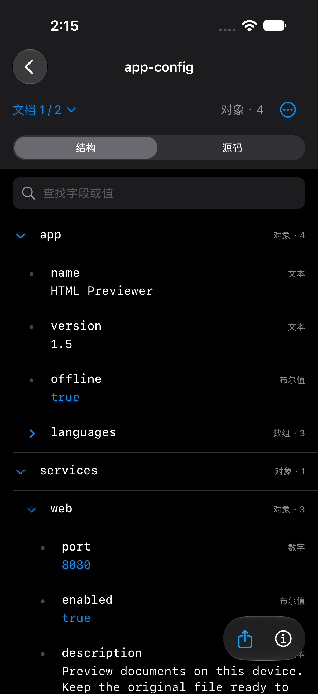 | 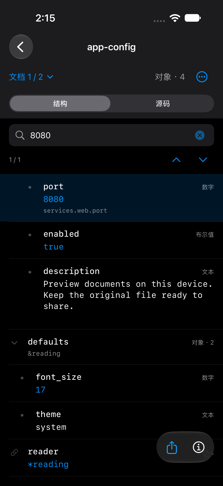 |
| 嵌套对象、数组、文本与布尔值分开显示。 | 原先折叠的 `services.web.port` 被找到并高亮。 |

| 源码与行号 | 多文档切换 |
| --- | --- |
| 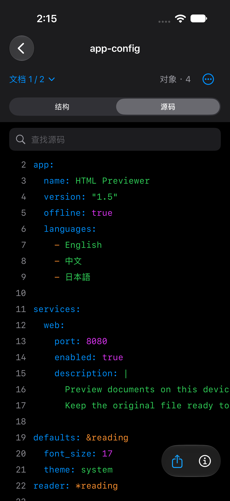 | 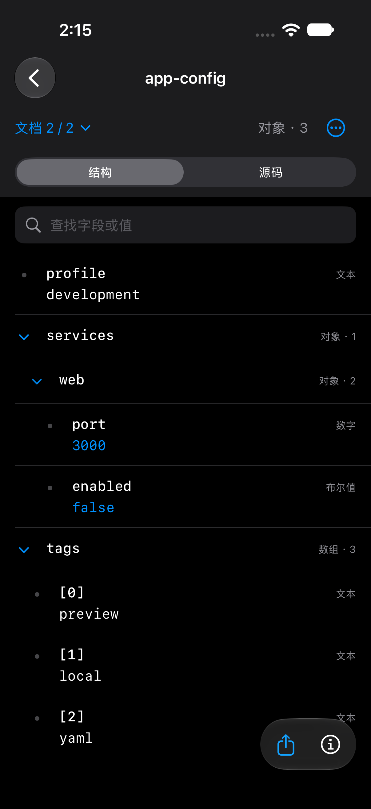 |
| 注释、语言列表与多行字符串保留可读写法。 | 第二份配置包含 `profile`、端口 `3000` 和标签数组。 |

| 首页入口与筛选 | 错误定位 |
| --- | --- |
| 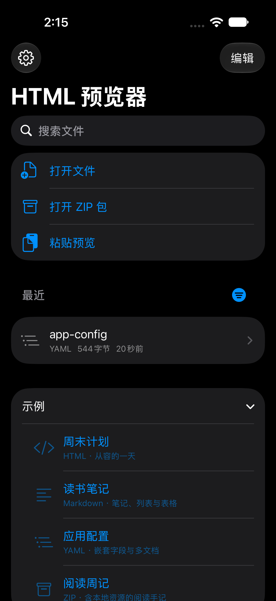 | 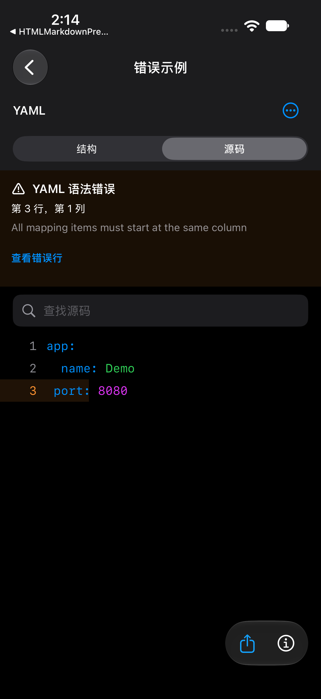 |
| 新示例与 YAML 最近文件接入现有文件库。 | 缩进错误定位到第 3 行；源码和原文件分享仍可使用。 |

| 长按字段的操作菜单 | 日文控件 |
| --- | --- |
| 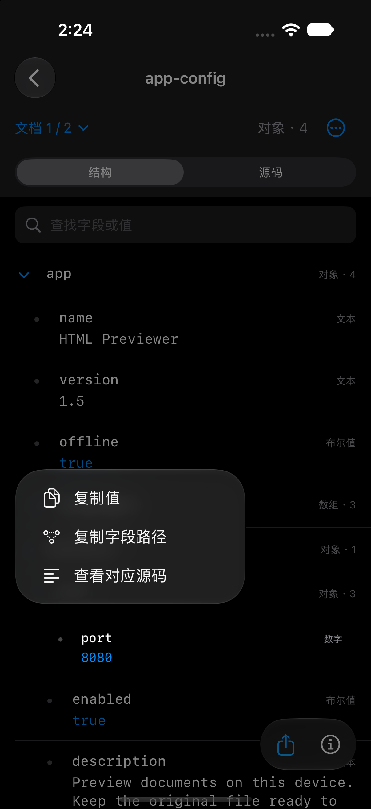 | 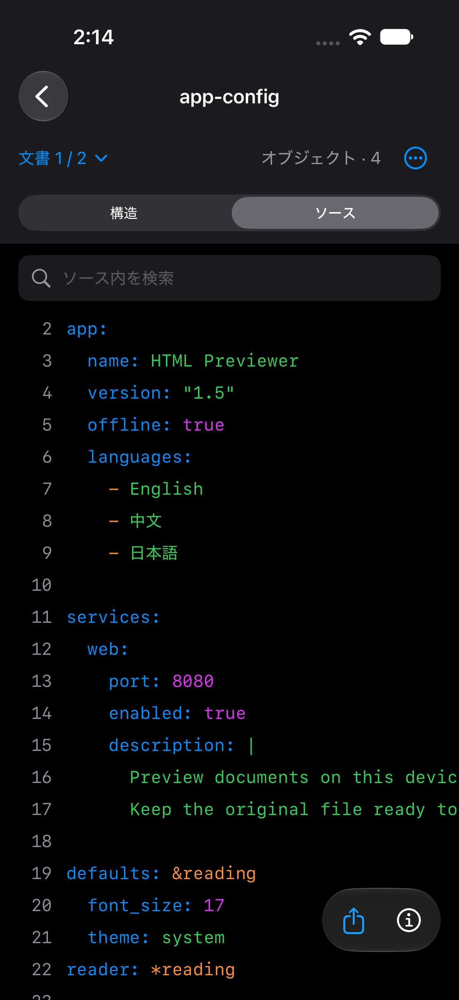 |

## iPad 实际截图

| 结构阅读 | 源码阅读 |
| --- | --- |
| 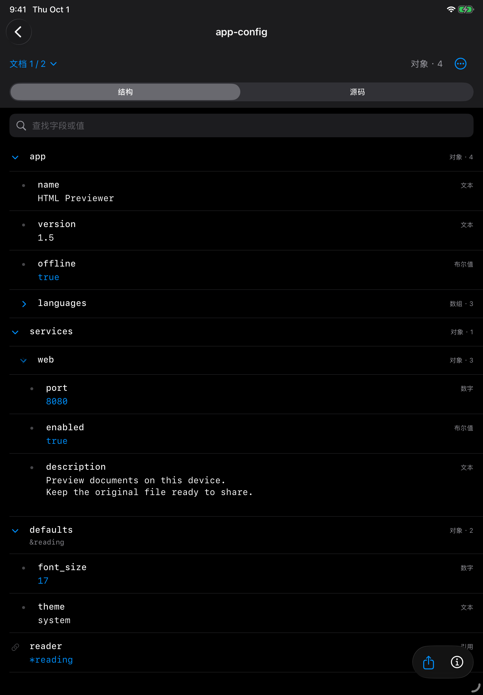 | 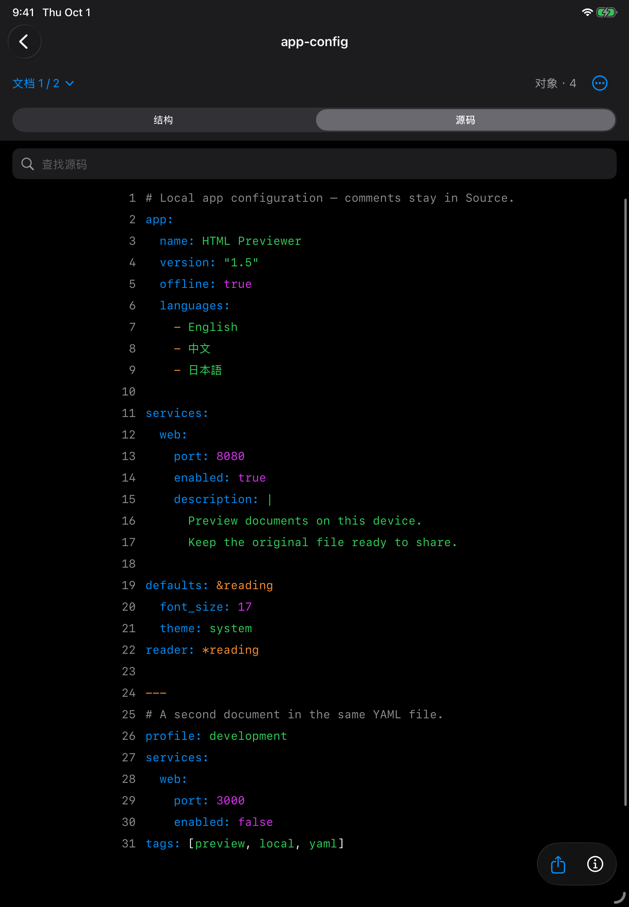 |

另外完成了系统文件回导：**分享原文件 → 存储到文件 → 我的 iPad 根目录 → 清空测试库 → 打开文件 → 选择保存的 YAML**。导入来源记录为 `fileImporter`，类型为 YAML；保存后再次导入的 544 字节与示例原文件完全一致。

| 系统文件选择器 | 从文件导入后的结构 |
| --- | --- |
| 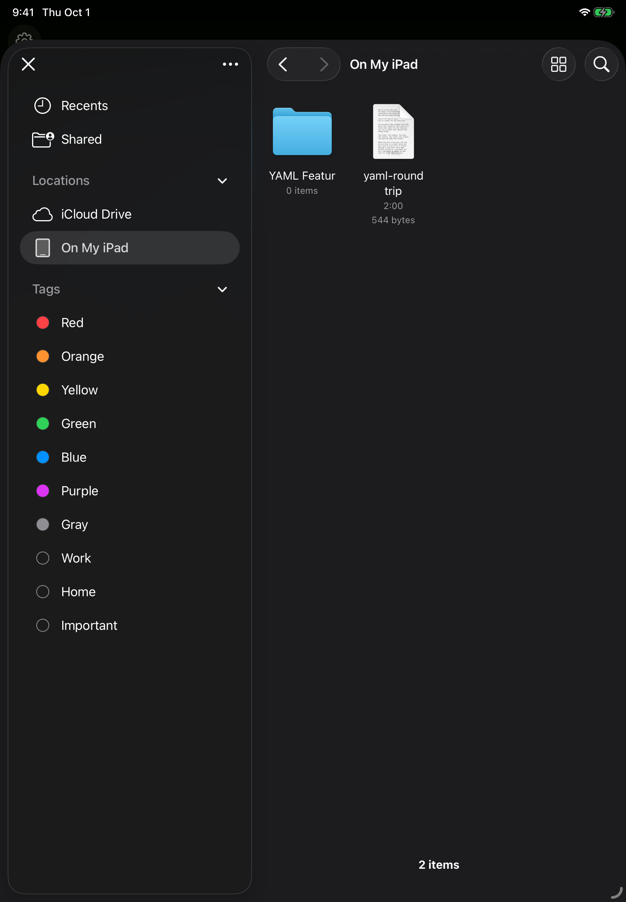 | 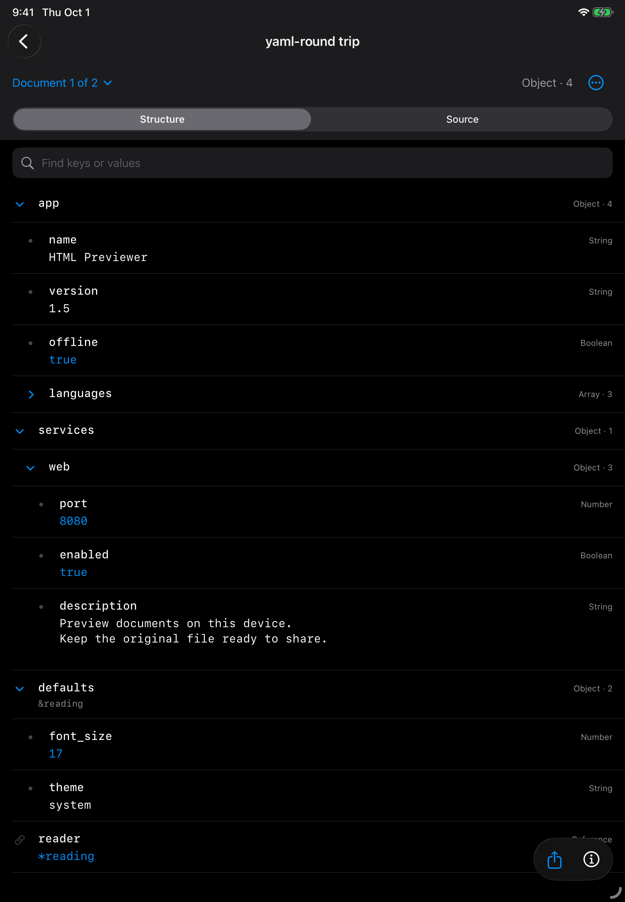 |

本轮文件回导使用模拟器的本地根目录。新建模拟器子目录中的保存按钮不可用，因此没有将该子目录保存记为通过。文件回导的原始元数据与内容校验见 [file-import-evidence.json](assets/2026-10-01-yaml/file-import-evidence.json)。

## 验证结果

| 验证 | 结果与覆盖范围 |
| --- | --- |
| iPhone 18 Pro / iOS 27.0 | 完整的 **165 项单元与集成测试通过**，包含 YAML 解析、文件导入、原始字节、文件类型、粘贴和阅读位置编码，以及现有 HTML / Markdown / ZIP 回归。 |
| iPhone YAML 交互 | **6 / 6 通过**：展开折叠、搜索、文档切换、重新打开与重启恢复、系统粘贴、值/路径/源码复制、错误行与原文件分享、中文截图、日文控件。 |
| iPad Air 11 英寸（M3）/ iPadOS 26.5 | 同一组 **6 / 6 YAML 交互通过**；另有 **8 / 8 YAML 业务测试通过**，并完成上面的真实系统文件回导。 |
| JavaScript 解析边界 | **6 / 6 通过**：YAML 1.2 类型、Unicode、多行文本、大整数源码、多文档、锚点与别名、重复键、未定义引用及复杂度上限。 |
| 静态核对 | 离线资源的源码/锁文件/包来源与 SHA-256 校验通过，四语言键与格式占位符一致，项目可移植材料检查与 `git diff --check` 通过。 |

复制测试通过 App 的系统粘贴按钮回读并逐字比较；文件导入测试也检查了 `.YML` 与 CRLF 原始字节保留。锚点写在映射键上、递归引用、未定义的键引用和先引用后定义均有解析测试。

可复查的结果汇总见 [validation-summary.json](assets/2026-10-01-yaml/validation-summary.json)，截图来源见 [screenshot-provenance.json](assets/2026-10-01-yaml/screenshot-provenance.json)。完整本地测试包保存在 `DerivedData/YAMLFeature/`。

## 本版范围

结构解析最多处理 2,000,000 个 UTF-8 字节、12,000 个节点、64 层集合嵌套和 100 份文档。超过结构复杂度时保留源码阅读；超过 2 MB 的文件只提供源码片段，并保留原文件分享。源码预览最多显示 200,000 个字符、20,000 行；大文件的片段不会作为完整源码复制。

别名显示为 `*name` 引用，不展开为最终合并配置；复杂映射键显示占位标签，完整写法可查看源码。YAML 分享原文件，PDF 导出与 ZIP 页面目录当前适用于 HTML / Markdown。

本次交付为本地代码与模拟器验证，尚未进行真机、TestFlight 或 App Store 发版。离线库重建与维护说明见 [vendor-yaml/README.md](../../scripts/vendor-yaml/README.md)。
