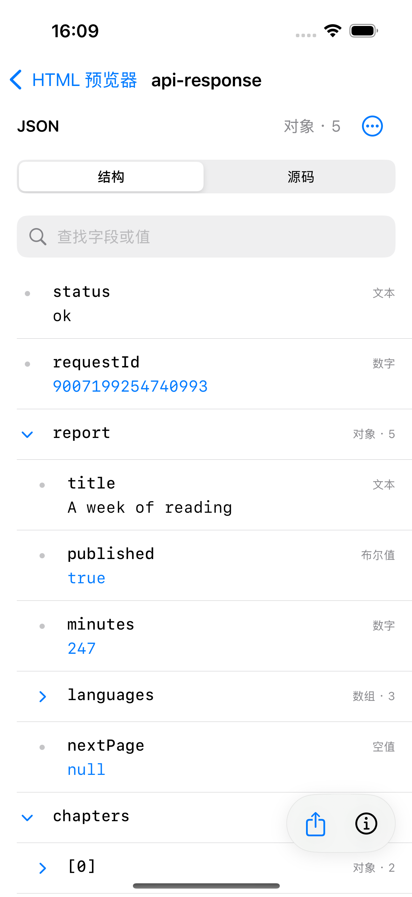
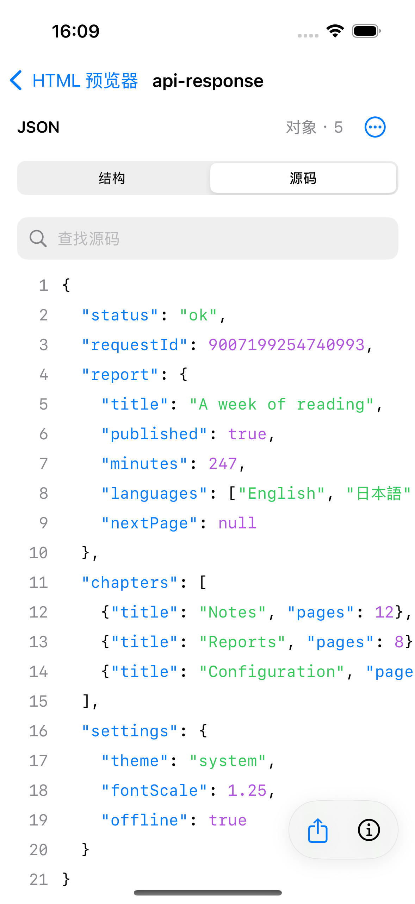
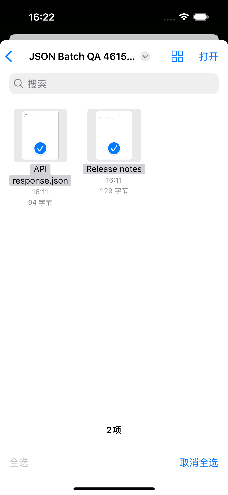
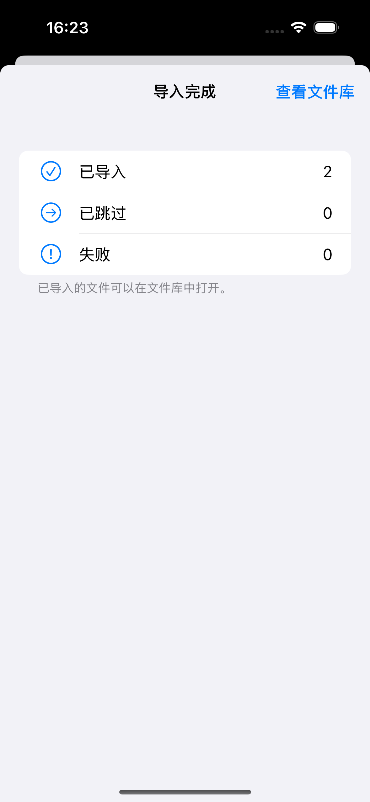
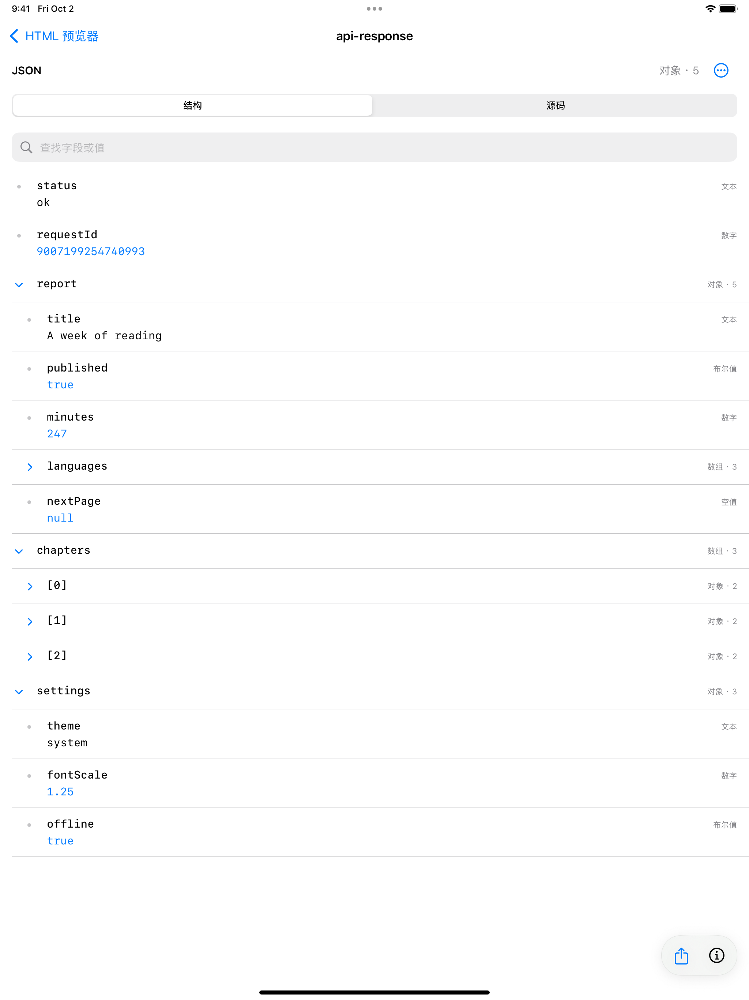
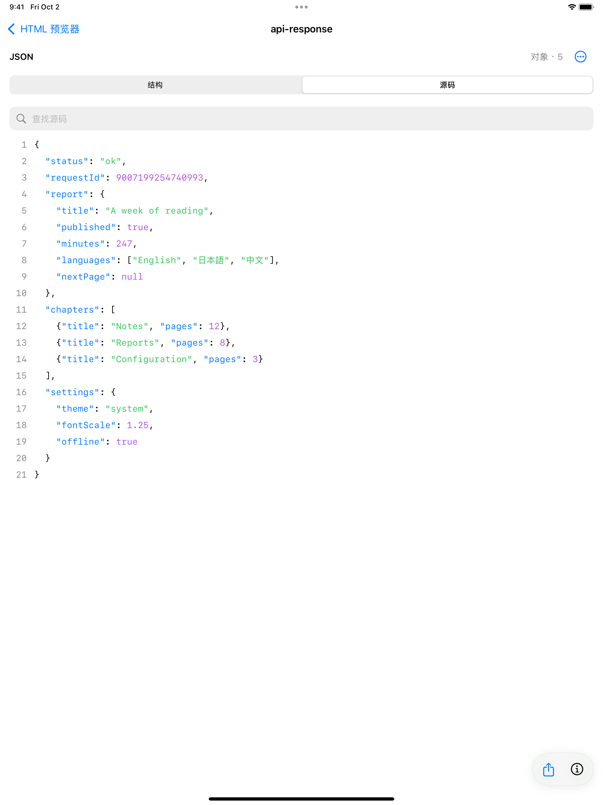

# JSON 结构预览与批量导入

2026-10-02 · 下一版本的本地开发内容（工程版本仍为 1.6 / 11）

## 可以做什么

- **打开 JSON**：系统文件选择器、从其他 App 打开、粘贴预览、内置示例和文件库筛选均已接入。
- **查看结构**：展开对象与数组、区分数字/文本/布尔/空值，搜索字段名、路径和值；搜索可找到折叠层级中的字段。
- **核对源码**：结构与带行号的源码之间切换，错误指向具体行列；无效 JSON 仍保留源码与原文件分享。
- **准确复制**：长按字段复制值、路径或跳到源码；复制集合保留原始 JSON 写法。大整数和指数不经过浮点数转换。
- **一次导入多份**：在系统选择器中多选文件，逐份处理重复文件的更新、保留两份或跳过；失败不会阻断后面的文件。最后显示导入、跳过、失败数量和失败文件原因。
- **保持日常操作**：只选择一份文件仍立即打开；批量完成后回到文件库。

解析、导入和保存均在设备本地完成。批量准备与提交由后台串行处理，界面显示进度；文件替换与阅读位置保存共享同一文件库事务锁，防止旧预览回调覆盖新内容。

## 体验入口

1. 首页展开“示例”，选择 JSON 的 **API 响应**，展开 `report`，搜索 `247`，查看数字、数组和嵌套字段。
2. 长按 `requestId`，复制值后通过“粘贴预览”核对 `9007199254740993`；切换“源码”查看原始写法。
3. “粘贴预览”可自动识别完整 JSON 对象/数组及 `json` 代码围栏；标量或有语法错误的普通文本可手动选择 JSON。
4. “打开文件”中多选 `.json`、`.md` 等文件，确认导入结果；重复文件可逐份决定如何处理。

## 范围

只读 JSON，支持标准 JSON，不支持注释、尾随逗号等 JSONC 扩展。结构处理上限为 2 MB UTF-8、12,000 个节点、64 层嵌套，并限制累计路径大小。超限时提供受限源码预览并保留原文件分享；不把片段当作完整源码复制。

JSON 原文件按字节保留，UTF-8 BOM 与 CRLF 不会在导入时重写。非 UTF-8 文件显示说明并可分享原文件。JSON 暂不导出 PDF。界面覆盖英文、简体中文、繁体中文和日文。

## 实际界面

以下均为本地运行截图，尚未制作为正式商店尺寸的宣传图。

| JSON 结构 | 带行号的源码 |
| --- | --- |
|  |  |

| 系统多选 | 导入结果 |
| --- | --- |
|  |  |

| iPad 结构 | iPad 源码 |
| --- | --- |
|  |  |

系统实测使用两份自制样例：94 字节的 JSON（包含 UTF-8 BOM、CRLF 和整数 `9007199254740993`），以及 129 字节的 Markdown。选择后结果为 **已导入 2 / 已跳过 0 / 失败 0**；从文件库重新打开 JSON，结构和值正确。两份文件的来源均为 `fileImporter`，保存字节的 SHA-256 与原文件一致。见 [原始字节校验](assets/2026-10-02-json-batch/system-import-evidence.json)和[截图来源](assets/2026-10-02-json-batch/screenshot-provenance.json)。

## 验证

- iPhone 16 / iOS 18.5 最终构建：**196 项单元与集成测试、5 项重点界面测试全部通过**。包含 JSON 精度与边界、导入来源与原始字节、批量三种重复文件选择、全部失败、单文件行为、跨实例并发保存，以及 JSON 搜索重开与 YAML 超大字号搜索。
- iPad Pro 12.9 英寸（第六代）/ iOS 18.5：第一轮 **3 项通过**，覆盖批量结果、JSON 中日文/大字号、搜索与重启恢复；短源码顶端对齐调整后，再运行 **3 项通过**，覆盖 JSON 及 YAML 多文档、源码与重启恢复。
- 此前完整界面轮次已通过 JSON 复制、错误分享、中日文显示和 YAML 的源码、复制、多文档与重启恢复。发现的搜索自动化清空问题及大字号定位问题已修复，并在最终轮次复测通过。
- 离线 YAML 资源校验、四语言键核对、可移植发布材料审计与 `git diff --check` 通过。
- 现有 `ReadingHTTPProbe` 测试辅助工具报告了一项 QoS 警告，该测试通过；本次未修改这个辅助工具。

详细测试包与设备信息见 [验证汇总](assets/2026-10-02-json-batch/validation-summary.json)。本轮不涉及真实设备测试。

复用既有 iPhone `D17454A3-3351-48DD-A61F-395E5E7EE3FF` 与 iPad `9216FE52-CA0E-4113-8ED5-19B4BF9755CE`，按设备串行测试。结束时两台均为 Shutdown；未新建、克隆、抹除或删除模拟器。系统导入样例已从模拟器移回本地验证目录，原始测试文件仍保留。

## 产品展示与使用统计

[商店定位与三语文案](../plans/2026-10-02-store-positioning-1.7.md)围绕“打开报告、阅读笔记、查看配置”，另为批量导入和 JSON 提供截图文案。

[使用情况测量方案](../plans/2026-10-02-usage-measurement.md)建议先看 Apple 自带的使用与留存数据，再决定是否增加默认关闭、用户主动同意的汇总统计。当前没有增加埋点、分析 SDK 或数据上传，也未读取本 App 的实际 Apple Analytics 报表。

本次内容尚未提交 TestFlight 或 App Store。
